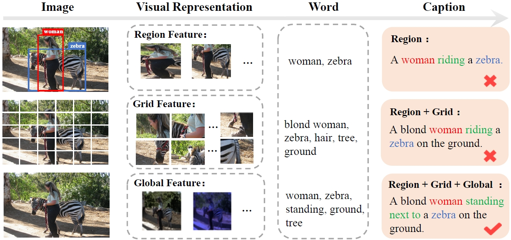
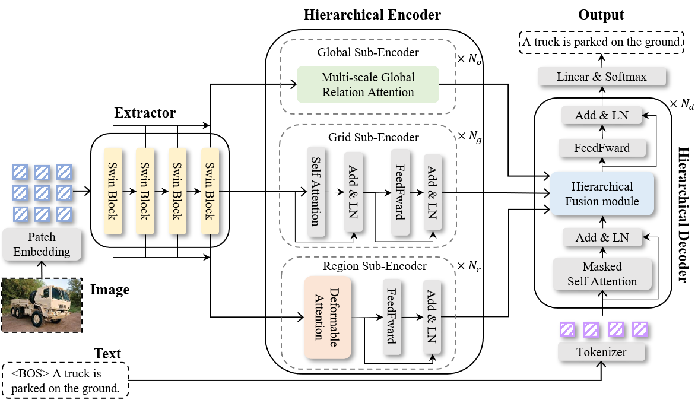

# Hierarchical Encoder-decoder for Image Captioning

## Introduction
The official repository for “Hierarchical Encoder-decoder for Image Captioning (HeriCap)”.

HeriCap is a model to  .

<p align="center">
     <br>
    The framework of the proposed Dynamic Transformer Network (DTNet) 
</p>


<p align="center">
     <br>
    The detailed architectures of different cells in the spatial and channel routing space.
</p>

## News

- 2025.12.24: Released code

## Environment setup

Please refer to [meshed-memory-transformer](https://github.com/aimagelab/meshed-memory-transformer)

## Data preparation
* **Annotation**.
* **Feature**. 
* **evaluation**.
* Evaluation score are calculate by [coco-caption](https://github.com/tylin/coco-caption) tool.

```python
path/to/hericap
├─── configs
├─── ....
└─── readme.md
path/to/dataset/
├───COCO2014/
        ├── annotations/  # annotation json files and Karapthy files
        ├── train2014/    # train images
        ├── val2014/      # val images
        └── test2014/     # test images
├───nocap
├───flickr8K
└───flickr30K
path/to/pretrain
|───region_ckpt.pth
└───hericap_ckpt_best.pth
```

## Training
We train hericap on 8 GPU A100 (80GB) in DDP mode by:
```python
export DATA_ROOT=/gemini/data-1/COCO2014
python train_caption.py exp.name=caption_finetune_region \
    model.detector.checkpoint=/gemini/pretrain/region_ckpt.pth \
    optimizer.finetune_xe_epochs=10 \
    optimizer.finetune_sc_epochs=10 \
    optimizer.batch_size=32 \
    optimizer.num_workers=4 \
    exp.ngpus_per_node=8 \
    exp.world_size=8 \
    model.cap_generator.decoder_name=Parallel \
    dataset.overfit=False 
```

## Evaluation
```python
export DATA_ROOT=/gemini/data-1/COCO2014
python eval_caption.py  split='test' exp.checkpoint=/gemini/pretrain/hericap_ckpt_best.pth
```

## Performance

<p align="center">
     <br>
    Comparisons with SOTAs on the Karpathy test split.
</p>


## Qualitative Results

<p align="center">
     <br>
    Examples of captions generated by Transformer and DTNet.
</p>


<p align="center">
     <br>
    Images and the corresponding number of passed cells.
</p>

<p align="center">
     <br>
    Path Visualization.
</p>


## Citations
```
```

## Acknowledgement
This code and our experiments are conducted based on the release code of [Swin Transformer](https://github.com/microsoft/Swin-Transformer) / [Deformable DETR](https://github.com/fundamentalvision/Deformable-DETR) / [M2-Transformer](https://github.com/aimagelab/meshed-memory-transformer) / [grit](https://github.com/davidnvq/grit) / [PureT](https://github.com/232525/PureT/tree/main) . Here we thank for their remarkable works.
