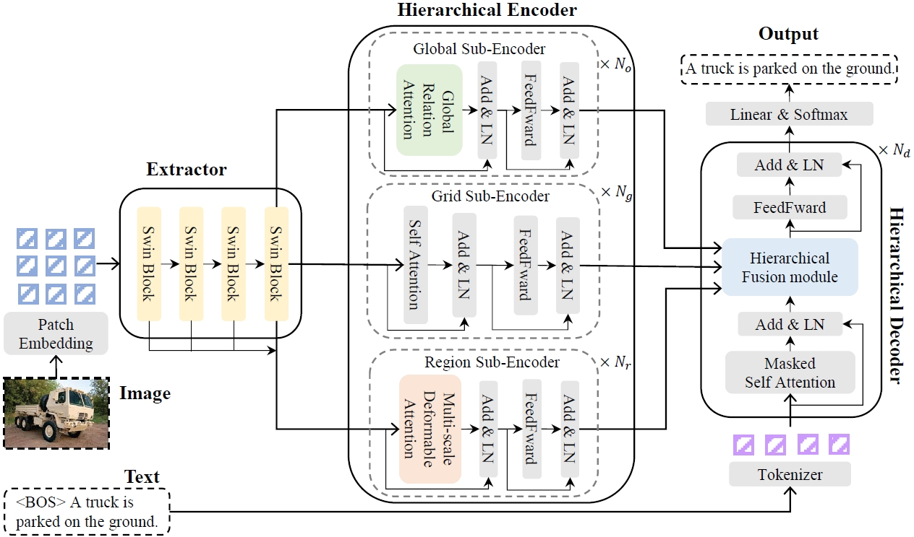
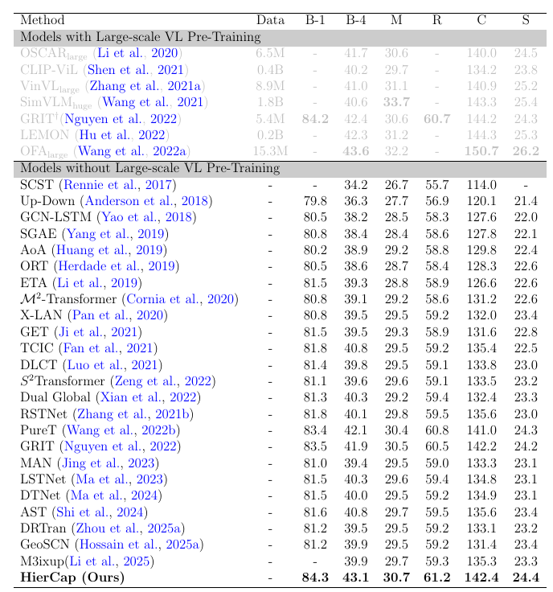

# Hierarchical Encoder-decoder for Image Captioning

## Introduction
The official repository for “Hierarchical Encoder-decoder for Image Captioning (HierCap)”.

HierCap is a model to guide text generation with hierarchical visual information at three
levels: global (encompassing positional relationships), regional
(highlighting principal objects), and grid (capturing local details).

<p align="center">
     <br>
    The illustration of captions generated by visual features of one or more hierarchies. 
</p>


<p align="center">
     <br>
    The overall architecture of HierCap.
</p>

## News
- 2025.02.19: Paper submitted.
- 2025.02.14: Released code.
- 2024.12.24: Build project.

## Environment setup

Please refer to [meshed-memory-transformer](https://github.com/aimagelab/meshed-memory-transformer).

## Data preparation
* **Annotation**:
* Download and extract COCO 2014 for image captioning including train, val, and test images with annotations from [MSCOCO](http://cocodataset.org).
* **Evaluation**:
* Evaluation score are calculate by [coco-caption](https://github.com/tylin/coco-caption) tool.

* **File list**:
```python
path/to/hiercap
├─── configs
├─── ....
└─── readme.md
path/to/dataset/
├───COCO2014/
        ├── annotations/  # annotation json files and Karapthy files
        ├── train2014/    # train images
        ├── val2014/      # val images
        └── test2014/     # test images
├───nocap
├───flickr8K
└───flickr30K
path/to/pretrain
|───region_ckpt.pth
└───hiercap_ckpt_best.pth
```

## Training
We train hiercap on 8 GPU A100 (80GB) in DDP mode by:
```python
export DATA_ROOT=/gemini/data-1/COCO2014
python train_caption.py exp.name=caption_finetune_region \
    model.detector.checkpoint=/gemini/pretrain/region_ckpt.pth \
    optimizer.finetune_xe_epochs=10 \
    optimizer.finetune_sc_epochs=10 \
    optimizer.batch_size=32 \
    optimizer.num_workers=4 \
    exp.ngpus_per_node=8 \
    exp.world_size=8 \
    model.cap_generator.decoder_name=Parallel \
    dataset.overfit=False 
```

## Evaluation
```python
export DATA_ROOT=/gemini/data-1/COCO2014
python eval_caption.py  split='test' exp.checkpoint=/gemini/pretrain/hiercap_ckpt_best.pth
```

## Inference
The inference on a RGB Image in [inference_example](https://github.com/Panlizhi/HierCap/blob/main/hericap/inference_captions.ipynb).


## Performance

<p align="center">
     <br>
    Comparisons with SOTAs on the Karpathy test split.
</p>


## Qualitative Results

<p align="center">
     <br>
    Visualization of attention heatmap in the caption generation process for the hierarchical fusion module of HierCap.
</p>


## Citations
```
This work is currently under submission.
```

## Acknowledgement
This code and our experiments are conducted based on the release code of [Swin Transformer](https://github.com/microsoft/Swin-Transformer) / [Deformable DETR](https://github.com/fundamentalvision/Deformable-DETR) / [M2-Transformer](https://github.com/aimagelab/meshed-memory-transformer) / [grit](https://github.com/davidnvq/grit) / [PureT](https://github.com/232525/PureT/tree/main) . Here we thank for their remarkable works.
